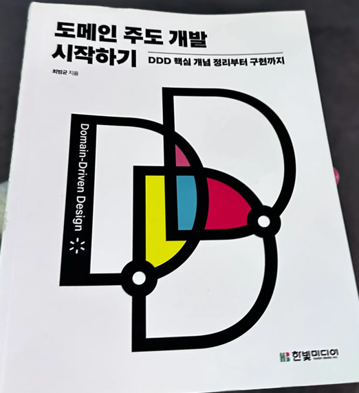

# 🎰 로또 과제 리팩토링 프로젝트

### 해당 프로젝트는 오픈미션동안 "도메인 주도 개발 시작하기"란 책을 읽고 DDD 패턴에 대하여 자세히 학습한 뒤 실제 프리코스 3주차 과제때 진행했던 로또 프로젝트를 학습한 책에 근거하여 리팩토링 하는 프로젝트입니다.


---

## 디렉토리 구조 및 아키텍처 설명
### [디렉토리 구조](https://github.com/LightPlu/precourse-openmission/blob/LightPlu/DIRECTORY_STRUCTURE.md)
### [아키텍처 설명](https://github.com/LightPlu/precourse-openmission/blob/LightPlu/ARCHITECTURE_DESCRIPTION.md)

---

## 리팩토링 시작 전 설계 및 리팩토링 과정에서 생긴 의문점

### [시작 전 설계](https://github.com/LightPlu/precourse-openmission/blob/LightPlu/BEFORE_REFACTORING.md)
### [의문점 및 해결](https://github.com/LightPlu/precourse-openmission/blob/LightPlu/REFACTORING_QUESTION.md)

---

# 📋 목차
## - [프로젝트 개요](#프로젝트-개요)
## - [주요 도메인 모델](#주요-도메인-모델)
## - [기술 스택](#기술-스택)

---

## 프로젝트 개요

DDD(Domain-Driven Design) 패턴을 적용한 로또 과제 리팩토링 프로젝트입니다.
회차별 티켓 발행, 당첨 번호 등록, 티켓과 당첨번호 비교 및 결과 조회 기능을 제공합니다.

### 핵심 기능
- 🎫 로또 티켓 자동 발행
- 🎯 당첨 번호 등록 및 비교
- 📊 회차별 당첨 결과 조회
- 💰 당첨금 계산

---

## 주요 도메인 모델

### 🎯 Entity vs Value Object 구분

#### Entity (식별자 보유)
| 클래스 | 식별자 | 역할 |
|--------|--------|------|
| Round | roundNumber | 회차 관리 |
| LottoTicket | ticketId | 티켓 관리 |

#### Value Object (불변 객체)
| 클래스 | 설명 |
|--------|------|
| Lotto | 6개의 로또 번호 집합 |
| LottoNumber | 1~45 사이의 숫자 |
| Cash | 금액 및 구매 횟수 |
| Rank | 등수 및 상금 |
| WinningLottoNumbers | 당첨 번호 (6개 + 보너스) |
| RoundResult | 등수별 당첨 통계 |
| CountResult | 맞춘 번호 개수 |

---

## 주요 Use Case

### 🎫 로또 티켓 관련
1. 로또 티켓 자동 발행

### 🎯 회차 관련
1. 새로운 회차 자동 시작
2. 모든 회차 조회
3. 특정 회차 결과 상세 조회

### 🏆 당첨 관련
1. 당첨 번호 등록
3. 회차 결과 계산 및 저장

### 🔄 회차 종료 플로우
```
1. 회차의 모든 티켓 조회
   ↓
2. 당첨 번호 조회
   ↓
3. 전체 티켓 비교 (LottoCompareService)
   ↓
4. RoundResult 저장
   ↓
5. 다음 회차 자동 시작
```

---

## 기술 스택

### 언어 & 프레임워크
- **Java**: 핵심 언어
- **Gradle**: 빌드 도구

### 데이터베이스
- **PostgreSQL**: 영속성 계층

### 테스트
- **JUnit**: 단위 테스트
- **TestContainers**: 통합 테스트 (Docker 기반)

### 아키텍처 패턴
- **DDD (Domain-Driven Design)**
- **Repository Pattern**
- **Aggregate Pattern**

---

## 설계 원칙

### DDD 전술적 패턴
- ✅ **Aggregate Root**: Round, LottoTicket
- ✅ **Entity**: 식별자 기반 관리
- ✅ **Value Object**: 불변 객체
- ✅ **Domain Service**: 도메인 로직 캡슐화
- ✅ **Repository**: 애그리거트 단위 영속화

---

## 테스트 전략

### 테스트 종류
- **단위 테스트**: 도메인 로직 검증
- **통합 테스트**: DB 연동 검증 (TestContainers 사용)
- **서비스 테스트**: 애플리케이션 서비스 검증

---

## 프로젝트 특징

### ✨ 장점
1. **도메인 중심 설계**: 비즈니스 로직이 순수한 Java 코드로 표현
2. **테스트 용이성**: 계층 분리로 독립적인 테스트 가능
3. **유지보수성**: 명확한 책임 분리
4. **확장성**: 새로운 기능 추가 시 기존 코드 수정 최소화

### 🎓 학습 포인트
- DDD 패턴 실습
- 의존성 역전 원칙 (DIP) 적용
- Repository 패턴 구현
- 수동 의존성 주입 (Composition Root)

---


