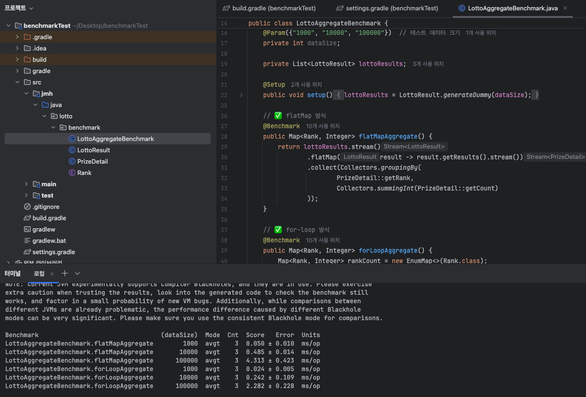

# DDD 패턴을 적용하여 Refactoring 해보기

---

## Entity vs VO
- Entity : 가장 큰 특징은 식별자를 가진다는 것
  - 식별자 : Entity 객체마다 고유한 구분할 수 있는 기준
- VO : 개념적으로 완전한 하나를 표현할 수 있는 것
---
## 로또 프로젝트에서 어떻게 Entity와 VO를 구분해야 할까?

- 우선 Entity와 VO를 구분하기 전에 어떻게 프로젝트 구조를 가져갈지에 대해 말해보아야 한다.

- 현재 3주차 과제를 진행함에 있어 식별자를 가지는 Entity가 필요한가?
  - 3주차 과제에선 과거 로또 기록을 필요로 하지도 않고, 누가 샀는지에 대한 기록도 필요하지 않다
  - 단순히 금액을 입력하고, 해당 금액에 맞게 로또를 발행하고, 발행된 로또를 비교해서 당첨금을 계산하는 로직만 필요하다
  

- 그렇다면 식별자를 가지는 Entity와 VO를 구분하기 위해선 어떠한 전제조건이 필요한가?
  - 우선 식별자를 활용할 수 있도록 문제를 정의하는 것부터 시작해야 된다
  
---

## 로또에서는 어떤것이 식별자를 가지고, 어떠한 문제점이 존재할까?

- 식별자를 활용할 수 있도록 로또를 관련지어야 한다면 어떤 것이 존재할까?
  - 로또를 사봤거나 검색해보았다면 알 수 있겠지만 한 게임당 총 5번의 로또 번호를 추첨할 수 있다 (ex: [1,2,3,4,5,6], [7,8,9,10,11,12], ...)
  - 로또 한 게임은 영수증과 같이 종이로 보관되기 때문에 해당 게임의 식별자를 두어 각 게임별로 구분지을 수 있다
  - 현재 로또 게임에 대하여 검색해본다면 각 회차별 당첨금액이 4,5등을 제외하고 다 다르다. 이는 각 회차별 로또 구매 금액이 매번 다르기 때문이다. 왜 다른지는 검색을 해본다면 보다 자세히 알 수 있다
    - 이를 통해 각 회차별로도 식별자를 가져 회차별로 구분할 수 있게 해야함을 의미한다

  
- 그렇다면 어떠한 것들이 식별자를 가지는 것인지 정리해보자
  - 로또의 각 게임 식별자 (로또 5번당 영수증 1개, 이때 영수증이 게임을 의미)
  - 로또의 각 회차 (로또에는 각 회차마다 등수별 몇명 당첨되었는지, 당첨금은 얼마인지에 대해 설명한다)

    
- 왜 로또는 개인정보를 활용해서 로또 구매에 대하여 저장해두지 않아서 실물 로또 분실시 당첨금을 수령할 수 없는 문제점을 아직도 해결하지 못하였는가?
  - 개인적인 생각으로 개인정보를 활용하여 구매한 로또에 대하여 구매 정보를 저장해두면 좋지 않을까 생각을 하고 인터넷 검색을 해보았더니 이미 2023년에 동행복권 웹사이트 해킹사건이 존재했다. 
  - 이는 이미 보안적으로 철저하게 관리한다고 해도 해킹은 발생할 수 있고, 언제든 개인정보 유출에 의한 위험 가능성이 존재한다는 것을 의미한다.
  - 만약 실물 로또에 개인정보를 추가하여 저장해둔다 하더라도 개인정보를 저장하고 있는 서비스가 해킹을 통하여 공격당한다면 여전히 피해를 입을 가능성이 존재한다.
  - 이처럼 인터넷 복권의 필요성을 느껴 인터넷 서비스는 개발하되, 기존 실물 복권은 사람들의 수요가 존재하고 접근성이 편한 장점때문에 아직까지 로또 분실의 책임을 사람들에게 남겨두고 실물 복권을 유지하고 있다고 생각한다.

---

## 그렇다면 식별자를 가지는 Entity와 하나를 표현하는 VO를 가지는 로또 프로젝트를 구현한다면 어떠한 것들로 나눌 수 있을까?
### 현재 3주차 과제에서는 각 회차별로 저장할 필요가 없어 사실 모든 것을 VO로 둬도 상관 없다고 생각한다. 한번 정해지면 바뀌는 것이 없기 때문이다. 하지만 이번 오픈미션에선 DDD 패턴에 대해 학습한 것을 적용하기 위한 리팩토링을 진행하기 때문에 상황을 가정하는 것부터 시작해야한다.

---

##  Entity를 두기 위하여 문제 정의를 가정해보겠다
  - 각 로또를 실물 로또를 통하여 구분해야 한다.
  - 각 회차별로 당첨 내역 및 당첨번호를 제공해야 한다

---

## Entity 및 VO

- 식별자로 인해 구분해야 하는 것(Entity)
  - Round(로또게임의 각 회차)[Aggregate Root]
    - 로또의 각 회차를 관리한다.
  - LottoTicket(로또의 각 게임)
    - 각 게임에는 최소 1개, 최대 5개의 로또 추첨이 들어갈 수 있다
    - 각 티켓별로 최종 당첨금을 계산하는 로직이 구현되어야 한다.
  - LottoResult(로또의 각 회차)
    - 각 회차별 등수마다 몇개의 당첨이 존재하고, 당첨금액은 얼마인지에 대해 표현한다.
  - WinningLottoNumbers(로또의 각 당첨번호)
    - 각 회차별 당첨번호는 어떻게 되는지에 대해 저장해둔다.
    - 각 회차별로 당첨금액처럼 저장만 해두면 되지 굳이 Entity로 정해야하나?
      - 확률적으로 가능할 진 모르겠지만 당첨번호를 보고 수동으로 로또 번호를 추첨하는 사람이 있을 수 있다. 그런 사람들을 위해 당첨번호만 조회할 수 있도록 따로 저장해두면 좋다고 생각된다.
      

- VO로 구분할 수 있는 것
  - Cash(로또 금액)
  - LottoNumber(로또 번호)
  - Lotto(각 로또 1번 구매[1000원])
  - Rank(등수)
  - CountResult(각 로또별 번호가 몇개 맞았는지에 대한 VO)
  - PrizeDetail(각 게임마다(로또 1~5개) 등수 카운팅 및 상금)

---

## 프로젝트를 리팩토링 하며 생긴 의문점

- Cash VO 내에 금액을 통하여 로또를 발행할 횟수를 저장하는 멤버변수 fullGameCount, remainingGameCount 멤버 변수를 따로 GameCount VO로 나누는 것이 맞을까?
  - 만약 GameCount를 통해서 다른 도메인 규칙이 생긴다면나누는게 맞다고 생각하지만, 현재 로또 규칙상 최대 금액 제한만 있으므로 굳이 나누지 않는다
  - Cash VO에서 최대 금액을 설정해두고 만약 최대 금액을 넘어선다면 에러를 발생하면 되기 때문이다

- 현재 PrizeDetail 클래스와 Rank 클래스는 같은 역할을 하는 것 아닌가?
  - 똑같이 Rank와 상금 및 갯수에 대해 다루고 있어서 혼동할 수 있다.
  - PrizeDetail VO같은 경우 한 Ticket당 등수별 몇개의 당첨이 됐는지, Ticket에서의 총 상금은 어떻게 되는지에 대한 VO이다.

- 현재 LottoResult Entity를 통해서 회차당 당첨된 내역들을 저장하려 했는데 현재 구현하는 도중 티켓별로 당첨 내역을 저장하기 위해 LottoResult를 사용했다. 어떻게 추후 구현을할까?
  - 우선 생각을 해보면 티켓별 내역을 굳이 저장해야하나? 필요없다. Entity -> VO로 이동시키자. 그러면 어떻게 회차별로 저장을 하지? 저장할 때 그저 회차내 모든 LottoResult들을 다 조회해서 더해야하나? 그렇다기엔 LottoResult를 DB에 저장해두기엔 너무 많은 공간 낭비가 들어간다.
  - LottoResult를 VO로 이동시키고, RoundResult를 Entity에 추가하여 당첨과 관련된 Aggregate Root로 만들자.
  - Round를 관리하는 Entity가 없으므로 Round Entity를 추가하고 해당 Entity를 Aggregate Root로 만듦. RoundResult Aggregate Root 아님.

- RoundResult를 구현하는 과정에서 평탄화라는 개념이 등장하는데 평탄화란것은 무엇일까?
  - 평탄화란 중첩된 자료구조(리스트 안의 리스트)를 한 단계로 펼치는 것을 말한다.
  - List<List<PrizeDetail>> -> List<PrizeDetail>.
  - 근데 과연 한 시점에서의 RoundResult를 구현하기 위해 평탄화를 적용시켜서 모든것들에 대한 계산을 하는게 성능적으로 좋을까?

- 로또의 당첨 내역은 일반적으로 생각해본다면 보너스번호를 입력한 시점 기준으로 발행된 모든 로또들의 당첨이 계산된다. 과연 한번에 모든것을 불러와서 비교하는것이 성능적으로 우세한가 아니면 티켓 하나하나 비교하면서 추가하는 것이 우세한가?
  - 우선 실물 로또는 사실 비교는 본인들이 하기때문에 이러한 과정을 고민할 필요가 없다. 하지만 인터넷으로 구매한 로또라면 분명 해당 로직에 대해서도 동행복권 내에서 고민했을 것이기 때문에 한번 찾아보려한다.
  - 
  - LLM을 통해서 공부를 하던 도중 benchmark테스트를 해볼 수 있다고 해서 한번 새로운 프로젝트를 만들어 flatMap을 통한 평탄화를 적용시킨 과정과, for루프를 통해서 집계를 하는 것의 차이점에 대해 benchmark를 돌려보았다.
  - 해당 과정을 통해 적은 데이터를 가지고 구현한다면 flatMap과 for루프의 차이점은 없었지만, 10만건 아래로 데이터수가 증가한다면 for루프가 훨씬 빠르다는 것을 확인하였다.
  - 하지만 로또는 검색해본다면 평균 회차당 5700만장이 팔린다는 것을 알 수 있다. 과연 내가 로직상으로 모든 것들을 불러와서 조희해서 계산하는 것이 짧은 시간내로 가능할까? 절대 안된다고 본다. DB에서 가능한지 추후에 DB를 연결하는 과정에서 알아보자.

- 과연 Lotto는 Entity로 보는것이 맞을까 VO로 보는것이 맞을까?
  - Lotto를 Entity로 본다면 DB 테이블을 생성하고, LottoTicket과 Lotto를 1:N관계로 봐야한다.
  - Lotto를 VO로 본다면 DB 테이블을 생성하지 않고, LottoTicket DB 테이블에 해당 Lotto들을 전부 저장한다.
  - 그렇다면 Lotto를 Entity로 보아야하는가? 아니면 VO로 보아야하는가?
    - 우선 로또 한개의 정보를 바탕으로 활용하는 것이 존재하는가?
      - 만약 로또를 1개만 구매한다면 티켓1장에 로또 1개가 들어있다. 그렇게 된다면 과연 의미가 있을까?
      - 어차피 티켓단위로 당첨번호와 비교할 것이기 때문에 필요 없다고 생각이 든다.
      - 따로 로또를 활용해서 번호 추첨 확률을 계산하고 특별한 로직이 존재하지 않기 때문에 따로 DB 테이블을 만들지 않아도 된다고 판단.
    - 만약 LottoTicket에 Lotto 리스트들을 모두 집어넣는다면 DB 정규화가 지켜지지 않는다. 이에 대한 판단은?
      - 현재 프로젝트는 DDD에 대한 학습과 적용을 우선시하고 있음 따라서 Lotto를 LottoTicket 테이블에 뭉탱이로 집어넣을 것. 만약 DB 정규화를 지켜야하는 프로젝트라면 Entity로 구분하는 것이 맞다고 판단.

- 티켓들을 한번에 DB에 저장하는 방법이 없을까? 만약 여러장 산다면 INSERT 쿼리가 여러번? 그러면 성능상 안좋아지지 않나?
  - Batch를 통해 INSERT 쿼리문을 한번만 쓰는것처럼 구현 가능. Batch에 대해선 추후 자세히 공부해볼 예정.